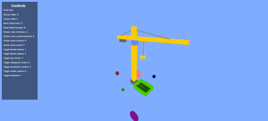
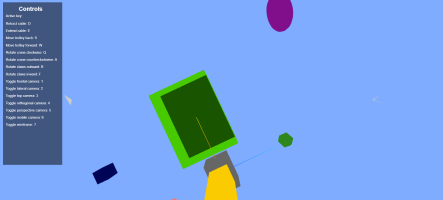
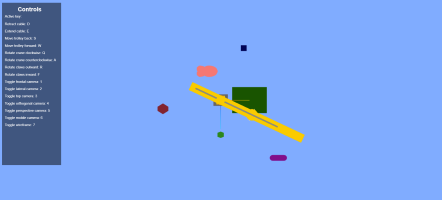

# Computer Graphics: Crane Simulation

This was the second project developed for the Computer Graphics course at Instituto Superior Técnico in the school year 2023/2024. It was made using the Three.js JavaScript library. It models a scene in which a moving crane is simulated, featuring several elements such as cameras, geometrical primitives and collisions.

It was developed by:

- [pedrofpclima](https://github.com/pedrofpclima)
- [dcaoc03](https://github.com/dcaoc03)
- [zecbfernandes](https://github.com/zecbfernandes)

The project was mostly done in English, while its guidelines were given in Portuguese.

Final Grade: 16.00

   